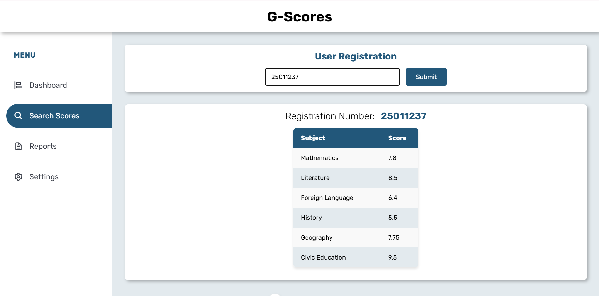
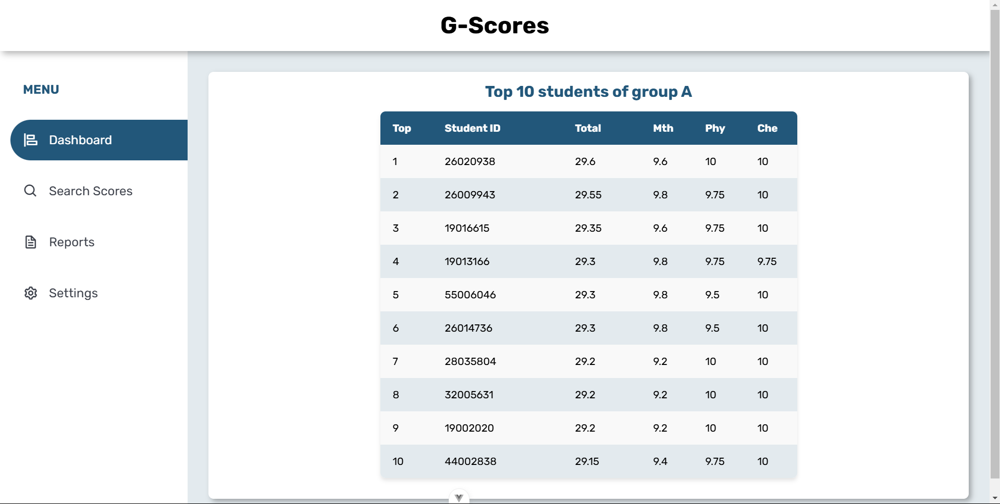
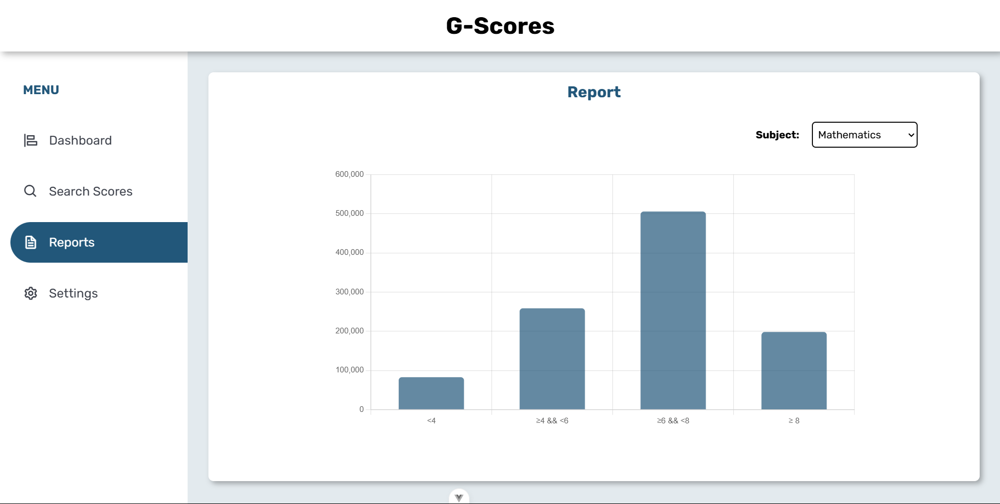

# G-Scores

## 0. Requirements

- Python 3.11
- PostgresSQL 16
- npm v11.0

## 1. Setup (Normal)

### a. Database

- Create PostgreSQL database `<db_name>`

- Create and config `.env` as below

```env
DATABASE_NAME=<db_name>
DATABASE_USER=<db_user>
DATABASE_PASSWORD=<db_password>
DATABASE_HOST=<host>
DATABASE_PORT=<port>
DATA_PATH=<path_to_data_file>
```

### b. Backend

- Install required python modules
```bash
cd backend/
pip install -r requirements.txt
```
- Prepare data
```bash
python manage.py migrate
python manage.py load_data
python manage.py generate_reports
```
- Run server
```bash
python manage.py runserver localhost:8000
```

### c. Frontend
- Build app
```bash
cd frontend/
npm install
npm run build
```
- Run app
```bash
npx http-server dist -p 8080
```

## 2. Docker deploy 
- Create PostgreSQL:
```bash
docker run --name postgres-app \                              
  --network gscore_network \
  -d -p 5432:5432 \
  -e POSTGRES_USER=postgres \
  -e POSTGRES_PASSWORD=123 \
  -e POSTGRES_DB=gscores_db \
  postgres:16-alpine
```
- Build Backend
```bash
docker build -t backend .  
docker exec -it python-backend python manage.py migrate 
docker exec -it python-backend python manage.py load_data 
docker exec -it python-backend python manage.py generate_repports
docker run --network gscore_network --name python-backend -dp 8000:8000 backend
```
- Build Frontend
```bash
docker build -t frontend .  
docker run --network gscore_network --name vue-frontend -dp 5173:5173 frontend
```

## 3. Features
- [ ✔ ] Conversion of raw data into the database must be coded and located in this source code 
- [ ✔ ] Check score from registration number input  
- [ ✔ ] Statistics of the number of students with scores in the above 4 levels by subjects
- [ ✔ ] List top 10 students of group A
- [ ✔ ] Responsive design
- [ ✔ ] Setup project use Docker


## 4. Technical details
- **Database**: PostgreSQL
- **Backend**: Django
- **Fronend**: VueJS

## 5. Demo Images
### Check scores:

### Top Group A:

### Report:


